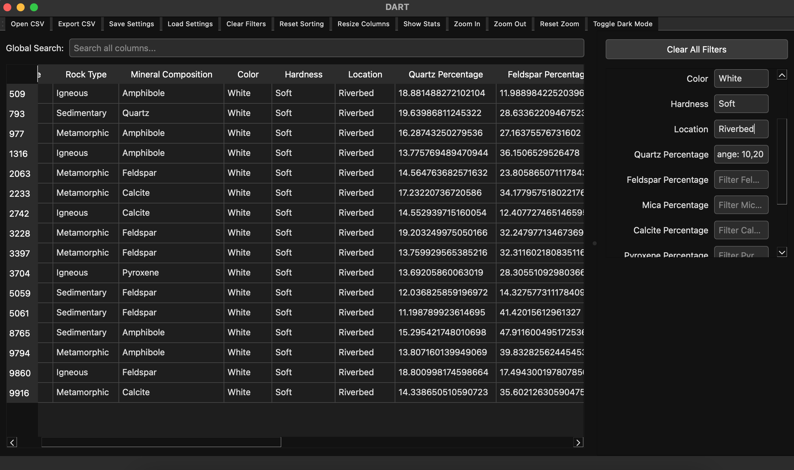

# DART | Data Access and Reformatting Tool

**Rock your CSVs!**  
DART is a modern, cross-platform desktop application built with PySide6 that lets you load, view, filter, sort, and export CSV data with ease. With advanced filtering commands, a sleek dark mode, and a rock‑inspired version naming scheme, DART turns data reformatting into a head-banging experience.

  
*DART in action – filtering and sorting CSV data with style!*

---

## Features

- **CSV Viewer:**  
  Load and display CSV files of any size with automatic encoding detection (using *chardet*).

- **Filtering:**  
  Use the following commands in filter fields:
  - `#range: x,y` – Filter numeric ranges
  - `#startswith: text` – Match beginning of cell text
  - `#contains: text` – Substring search
  - `#equals: text` – Exact match
  - `#endswith: text` – Match text endings
  - `#not: text` – Exclude specific terms
  - `#regex: pattern` – Use regular expressions
  - `#in: value1, value2, ...` – Match one of multiple values

- **Sorting & Exporting:**  
  Sort data by clicking column headers and export the filtered/sorted view to CSV.

- **Customizable UI:**  
  Toggle between dark and light modes, adjust columns, and enjoy a responsive layout with a scrollable filter panel.

- **Zoom & Visual Enhancements:**  
  Zoom in, zoom out, or reset zoom on the data for a tailored viewing experience.

---

## Usage

### Running DART

1. **Clone the Repository:**

   ```bash
   git clone https://github.com/alfaoz/dart.git
   cd dart
   ```

2. **Install Dependencies:**

   Make sure you have Python 3.7+ installed, then create a virtual environment and install the requirements:

   ```bash
   python -m venv .venv
   source .venv/bin/activate  # On Windows: .venv\Scripts\activate
   pip install -r requirements.txt
   ```

   *Note: The `requirements.txt` should include PySide6, chardet, and any other dependencies.*

3. **Launch the Application:**

   ```bash
   python main.py
   ```

   DART will open with a modern UI where you can load CSV files, apply filters, sort data, and export your results.

### CSV File Loading & Filtering

- **Load CSV:**  
  Click **File > Open CSV** to select and load a CSV file. DART will automatically detect the encoding and display your data in the table.

- **Apply Filters:**  
  Use the filter fields on the right to enter advanced commands (e.g., `#range: 10,20`, `#startswith: Hello`). The table view updates dynamically.

- **Global Search:**  
  Use the global search bar above the table to filter rows across all columns.

- **Sort & Export:**  
  Click on column headers to sort the data. When done, export your filtered/sorted CSV via **File > Export CSV**.

### Zooming the Data

DART now includes zoom controls:
- **Zoom In/Out:**  
  Use the toolbar buttons to scale the data view.
- **Reset Zoom:**  
  Restore the default zoom level with the **Reset Zoom** button.

---

## Versioning & Changelog

DART uses rock‑inspired version names. Here’s a brief version history:

- **v1.0 "Yosemite"**  
  - Initial release with basic CSV viewing and filtering.

- **v1.1 "Arches"**  
  - Added advanced filtering commands and encoding detection.

- **v1.2 "Joshua Tree"**  
  - Introduced dark mode and improved UI responsiveness.

- **v2.0 "Red Rocks"**  
  - Launched the interactive bundler (BunMapP) with universal packaging support.

- **v2.1 "Cappadocia"**  
  - Optimized UI layout with a scrollable filter panel and enhanced model updates.

- **v2.2 "Petra" (Upcoming)**  
  - Future enhancements and new features based on user feedback.

See the [CHANGELOG.md](CHANGELOG.md) for more details.

---

## Contributing

Contributions, bug reports, and feature requests are welcome!  
Please see [CONTRIBUTING.md](CONTRIBUTING.md) for details.

---

## License

DART is released under the MIT License. See the [LICENSE](LICENSE) file for more details.

---

## Contact

Developed by **Alfa Ozaltin**  
For more information or support, visit our [GitHub Issues](https://github.com/alfaoz/dart/issues) page.

---

#DART for the win!
